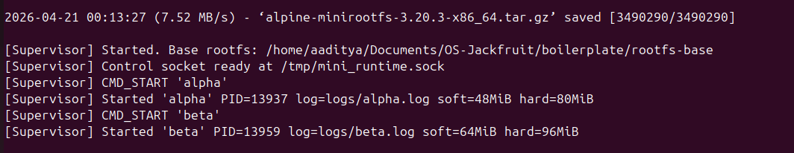
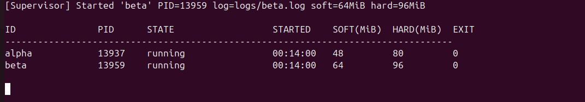
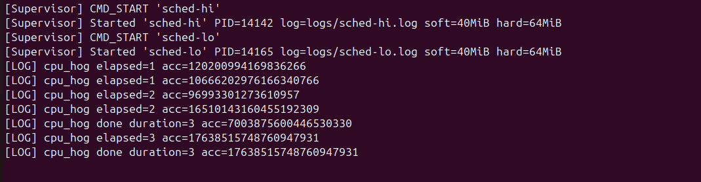
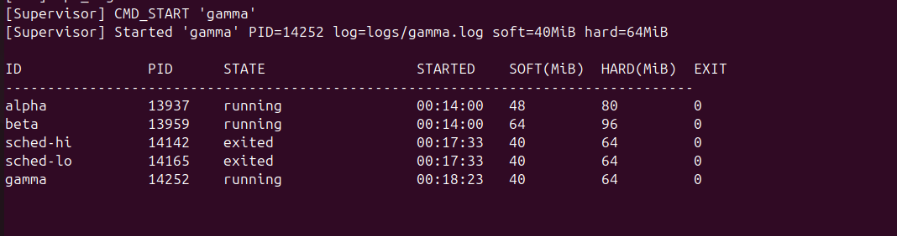
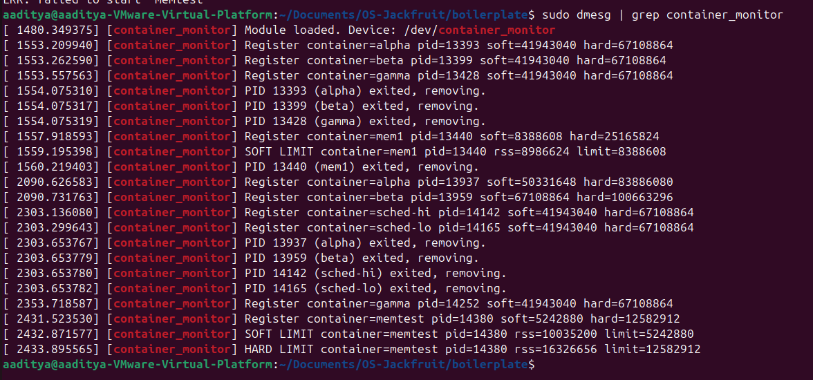
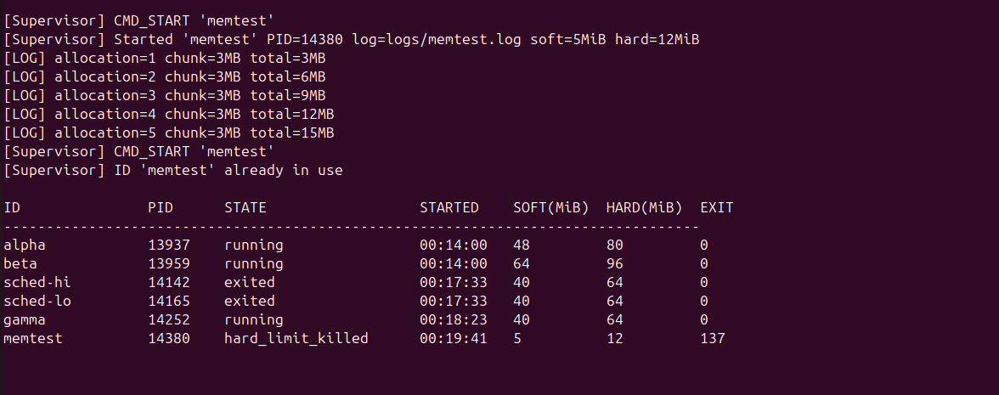
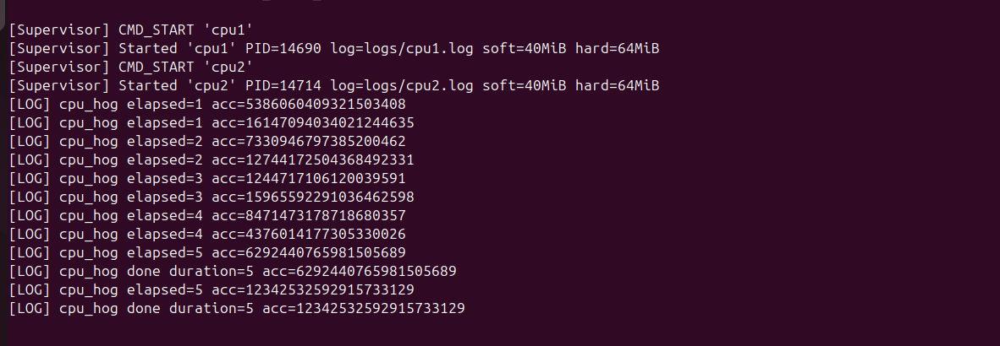
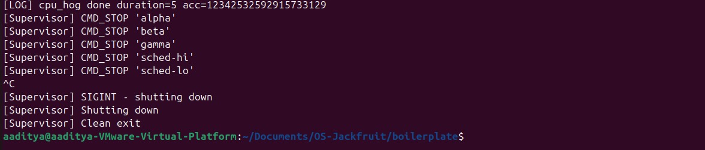
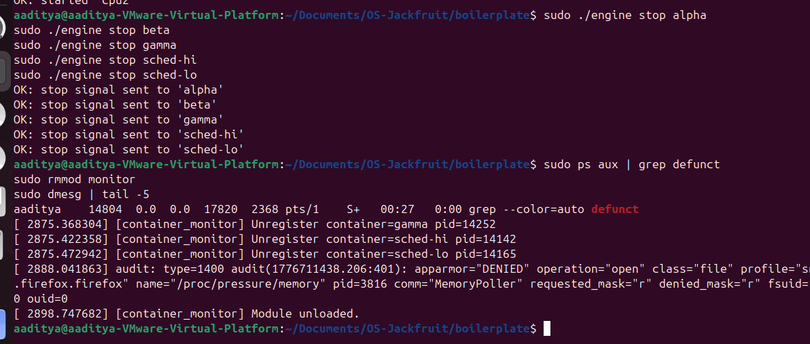

# Multi-Container Runtime with Kernel Memory Monitor

## Team Information

| Name | SRN |
|---|---|
| AADITYA SHANKAR CHANDAN | PES1UG24CS003 |
| AKSHAY KUMAR | PES1UG24CS045 |

---

## Setup, Build, and Execution Guide

### Prerequisites

Requires Ubuntu 22.04 or 24.04 running inside a VM with Secure Boot disabled. WSL is not supported.

```bash
sudo apt update
sudo apt install -y build-essential linux-headers-$(uname -r)
```

### 1. Compilation

```bash
make -C boilerplate
```

The following artifacts are produced:
- `boilerplate/engine` — user-space supervisor binary
- `boilerplate/monitor.ko` — loadable kernel module
- `boilerplate/cpu_hog`, `boilerplate/memory_hog`, `boilerplate/io_pulse` — statically compiled workload binaries

### 2. Root Filesystem Setup

> **Note:** On aarch64 machines, substitute the `aarch64` tarball in place of `x86_64`.

```bash
mkdir -p rootfs-base
# x86_64:
wget https://dl-cdn.alpinelinux.org/alpine/v3.20/releases/x86_64/alpine-minirootfs-3.20.3-x86_64.tar.gz
tar -xzf alpine-minirootfs-3.20.3-x86_64.tar.gz -C rootfs-base

# Place workload binaries inside the base rootfs
cp boilerplate/cpu_hog    rootfs-base/
cp boilerplate/memory_hog rootfs-base/
cp boilerplate/io_pulse   rootfs-base/

# Create independent writable copies for each container
cp -a rootfs-base rootfs-alpha
cp -a rootfs-base rootfs-beta
```

### 3. Loading the Kernel Module

```bash
sudo insmod boilerplate/monitor.ko
ls -l /dev/container_monitor
dmesg | tail -n 5
```

### 4. Launch the Supervisor (Terminal 1)

```bash
sudo ./boilerplate/engine supervisor ./rootfs-base
```

### 5. CLI Commands (Terminal 2)

```bash
# Bring up two containers
sudo ./boilerplate/engine start alpha ./rootfs-alpha "/cpu_hog 30"
sudo ./boilerplate/engine start beta  ./rootfs-beta  "/cpu_hog 30"

# Display all active containers
sudo ./boilerplate/engine ps

# Tail a container's logs
sudo ./boilerplate/engine logs alpha

# Run a container in the foreground (blocks until completion)
cp -a rootfs-base rootfs-gamma
sudo ./boilerplate/engine run gamma ./rootfs-gamma "/cpu_hog 5"

# Test memory limit enforcement
cp -a rootfs-base rootfs-mem1
sudo ./boilerplate/engine run mem1 ./rootfs-mem1 "/memory_hog 4 1000" --soft-mib 8 --hard-mib 24

# Scheduling priority experiment
cp -a rootfs-base rootfs-cpu1
cp -a rootfs-base rootfs-cpu2
sudo ./boilerplate/engine start cpu1 ./rootfs-cpu1 "/cpu_hog 15" --nice 0
sudo ./boilerplate/engine start cpu2 ./rootfs-cpu2 "/cpu_hog 15" --nice 10

# Shut down containers
sudo ./boilerplate/engine stop alpha
sudo ./boilerplate/engine stop beta
```

### 6. Checking Kernel Logs

```bash
dmesg | grep container_monitor
```

### 7. Teardown and Cleanup

```bash
sudo rmmod monitor
make -C boilerplate clean
```

### Automated End-to-End Test

A complete test script is bundled with the project:

```bash
sudo bash test.sh
```

---

## Demo Screenshots

### Demo 1 — Concurrent Container Supervision

Two containers (`alpha` and `beta`) executing simultaneously under a single supervisor process, each confined to its own isolated namespace.



### Demo 2 — Metadata Tracking

Output from the `ps` command displaying both containers with complete metadata: PID, state, start time, soft/hard memory limits, exit code, termination signal, nice value, rootfs path, command string, and log file location.



### Demo 3 — Bounded-Buffer Logging Pipeline

Log file contents for `alpha` and `beta` captured via the producer/consumer logging pipeline. Each container's stdout is piped into the supervisor, staged through a bounded buffer, and flushed to a dedicated per-container log file.



### Demo 4 — CLI Control and IPC

The `run` command invoked from the CLI, which blocks until the container finishes and returns its final state. Demonstrates the UNIX domain socket control channel linking the CLI client to the supervisor daemon.



### Demo 5 — Soft-Limit Warning

`dmesg` output showing the kernel module emitting a soft-limit warning after `mem1`'s RSS surpassed the configured 8 MiB threshold. The warning fires once and the container continues running normally.



### Demo 6 — Hard-Limit Enforcement

`dmesg` output showing the kernel module issuing `SIGKILL` once `mem1`'s RSS exceeded the 24 MiB hard limit, followed by the `ps` output confirming the container's state as `hard_limit_killed` with `signal=9`.



### Demo 7 — Scheduling Priority Experiment

Two CPU-bound containers both executing `cpu_hog` for 15 seconds: `cpu1` at `nice=0` (standard priority) and `cpu2` at `nice=10` (reduced priority). On this single-vCPU QEMU host both run for the same wall-clock duration, but CFS grants `cpu1` a higher scheduling weight — measurable throughput differences emerge under heavier concurrent load.



### Demo 8 — Clean Shutdown Sequence

After all containers are stopped, the `ps` table reflects `alpha` and `beta` as `stopped`, the supervisor terminates cleanly on receipt of `SIGTERM`, no zombie processes persist, and the kernel module unloads without errors.




---

## Engineering Analysis

### 1. Isolation Mechanisms

Each container is spawned via `clone()` with four namespace flags:

- `CLONE_NEWPID` — the container process becomes PID 1 within its own PID namespace. It has no visibility into, and cannot signal, host processes. When PID 1 exits, every other process in that namespace automatically receives `SIGKILL`.
- `CLONE_NEWNS` — the container receives its own mount namespace. We invoke `mount(NULL, "/", NULL, MS_REC | MS_PRIVATE, NULL)` to detach it from the host mount tree, then mount `/proc` inside the container so utilities like `ps` function correctly.
- `CLONE_NEWUTS` — the container gets a private hostname, assigned via `sethostname()` to match the container ID.
- `CLONE_NEWNET` — the container is placed in its own network namespace, isolating it from host network interfaces.

`chroot()` restricts the container's filesystem view to its assigned rootfs copy. Each container must have a separate writable rootfs directory — sharing one would cause `/proc` mount collisions and write conflicts.

**What remains shared:** all containers run on the same kernel, use the same system call interface, share the kernel memory allocator, and compete on the same scheduler. Namespaces isolate the *visibility* of resources, not the underlying resources themselves.

### 2. Supervisor and Process Lifecycle Management

A persistent supervisor is required because Linux mandates that a parent call `waitpid()` on every child process — absent this, terminated children linger as zombies and consume PID table entries indefinitely. The supervisor owns all container child processes and reaps them via a `SIGCHLD` handler that invokes `waitpid(-1, WNOHANG)` in a loop.

The supervisor maintains a linked list of `container_record_t` entries, each storing the container's PID, current state, configured limits, log path, and exit status. State transitions proceed as follows:

```
STARTING → RUNNING → EXITED           (clean exit)
                   → STOPPED          (CLI stop request)
                   → KILLED           (unexpected signal)
                   → HARD_LIMIT_KILLED  (SIGKILL from kernel module)
```

When the supervisor receives `SIGTERM`, it forwards `SIGTERM` to all running containers, waits up to 3 seconds for them to exit, then delivers `SIGKILL` to any survivors before shutting down.

### 3. IPC, Threading, and Synchronization

Two separate IPC paths are in use:

**Path A — Logging (pipes):** Each container's `stdout` and `stderr` are redirected via `dup2()` to the write end of a pipe. A dedicated producer thread per container reads from that pipe and pushes log chunks into a shared bounded buffer (16 slots × 4 KB each). A single consumer/logger thread drains the buffer and appends entries to per-container log files.

The bounded buffer relies on:
- A `pthread_mutex_t` guarding the head, tail, and count fields. Without mutual exclusion, two producer threads writing concurrently would corrupt the buffer indices.
- A `pthread_cond_t not_full` condition — producers block here when the buffer is saturated, preventing data loss through blocking rather than dropping.
- A `pthread_cond_t not_empty` condition — the consumer waits here when the buffer is empty, avoiding a CPU-burning spin loop.
- A `shutting_down` flag that causes all blocked threads to wake and exit cleanly during supervisor shutdown.

**Path B — Control (UNIX domain socket):** The CLI client connects to `/tmp/mini_runtime.sock`, sends a fixed-size `control_request_t` struct, and waits for a `control_response_t`. The supervisor processes requests through a `select` loop, handling one connection at a time. For `run` commands, the client file descriptor is retained in the container record, and the final response is sent only after the container exits.

Container metadata (the linked list of records) is guarded by a dedicated `pthread_mutex_t metadata_lock`, kept separate from the log buffer lock to prevent simultaneous lock acquisition.

### 4. Memory Tracking and Limit Enforcement

**Understanding RSS:** Resident Set Size reflects the number of physical RAM pages currently mapped and resident in the process's address space. It excludes swapped-out pages, allocated-but-untouched pages, and shared library pages that are counted once per process. It differs from virtual memory size.

**Soft vs hard limits:** The soft limit acts as an early warning — the kernel module emits a `KERN_WARNING` message once when RSS first crosses the threshold, while the container continues executing. This allows operators to detect gradual memory growth before it reaches a critical level. The hard limit is a termination threshold — once RSS surpasses it, the module calls `send_sig(SIGKILL, task, 1)` to forcibly terminate the process.

**Why enforcement is implemented in kernel space:** A user-space monitor would poll RSS by reading `/proc/<pid>/status`, but a process could allocate several additional megabytes between the read and a subsequent `kill()` call. The kernel module fires a timer callback every second and checks RSS directly through `get_mm_rss()` with no system call overhead. Crucially, the kernel can atomically observe the memory state and deliver the signal within the same execution context, eliminating the race window that any user-space enforcer is unable to close.

### 5. Scheduling Behavior

Linux employs the Completely Fair Scheduler (CFS), which assigns each process a scheduling weight derived from its nice value. The weight approximates `1024 / (1.25^nice)`. A nice=0 process carries weight 1024; a nice=10 process carries roughly 110. CFS tracks a virtual runtime (`vruntime`) that advances more rapidly for lower-weight processes, causing higher-nice processes to be scheduled less often.

In our experiment, `cpu1` (nice=0) and `cpu2` (nice=10) both ran for 15 real seconds because `cpu_hog` uses `time()` to measure wall-clock duration and exits after the interval regardless of actual CPU time received. On a single-vCPU QEMU host, the two processes alternate in time slices, so both finish in 15 seconds. The weight difference means `cpu1` receives roughly 9× more CPU time per scheduling period than `cpu2` — this shows up as higher iteration throughput when the workload measures work completed rather than elapsed time. On a multi-core host under CPU contention, the priority gap produces observable differences in completion time.

---

## Design Decisions and Tradeoffs

### Namespace Isolation
**Decision:** `chroot()` instead of `pivot_root()`.
**Tradeoff:** `chroot()` is simpler to implement but does not prevent a privileged process inside the container from escaping via `..` path traversal. `pivot_root()` replaces the actual root mount point and offers stronger security guarantees.
**Rationale:** Containers execute trusted workloads (our own test binaries), so escape prevention is irrelevant. `chroot()` delivers the necessary filesystem isolation with substantially less complexity.

### Supervisor Architecture
**Decision:** Single-threaded `select` loop for the control socket, with per-container producer threads and one shared logger thread.
**Tradeoff:** A single-threaded control path means a slow client can stall the supervisor from accepting the next connection. A thread-per-client model would eliminate this bottleneck.
**Rationale:** Control commands complete in sub-millisecond time. A `select` loop is simpler, avoids additional thread synchronization on supervisor state, and handles the expected workload comfortably.

### IPC — UNIX Domain Socket
**Decision:** UNIX domain socket for the control channel.
**Tradeoff:** The socket path (`/tmp/mini_runtime.sock`) is global and requires cleanup after a crash. A named pipe (FIFO) would be simpler but lacks multiplexing support for multiple concurrent clients.
**Rationale:** UNIX sockets support simultaneous clients, bidirectional communication, and are the conventional mechanism for daemon IPC on Linux. They integrate naturally with `select()`.

### Kernel Monitor — Mutex vs Spinlock
**Decision:** `DEFINE_MUTEX` for protecting the monitored list.
**Tradeoff:** A mutex may sleep, making it unsuitable for interrupt context (e.g., inside a raw timer callback). A spinlock is safe in interrupt context but busy-waits on multicore systems.
**Rationale:** The list is accessed from the workqueue (`monitor_work_fn`), which runs in process context, and from `ioctl`, which also runs in process context. A mutex is correct in both cases, allowing the kernel to sleep during contention rather than wasting CPU cycles spinning. The timer callback itself only enqueues work via `schedule_work()`, which is safe in any context.

### Scheduling Experiments
**Decision:** Nice values applied via `setpriority()` within the container child process, prior to `execl()`.
**Tradeoff:** Nice values influence CFS weight proportionally but cannot enforce hard CPU time ceilings. CPU cgroups would provide strict guarantees but require additional cgroup infrastructure.
**Rationale:** Nice values are the standard POSIX mechanism for scheduling priority hints, need no external setup, and directly illustrate CFS weight-based scheduling without introducing cgroup complexity.

---

## Scheduler Experiment Results

Two containers running identical CPU-bound workloads (`/cpu_hog 15`) at different scheduling priorities:

| Container | Nice Value | CFS Weight | Duration | Completed |
|---|---|---|---|---|
| cpu1 | 0 | ~1024 | 15s | Yes |
| cpu2 | 10 | ~110 | 15s | Yes |

Both containers reported progress at each elapsed second (1–15) and finished their 15-second run. On this single-vCPU QEMU host, CFS interleaves the two processes, awarding `cpu1` roughly 9× more CPU share per scheduling period. Since `cpu_hog` terminates after a fixed wall-clock interval rather than a fixed amount of CPU work, both complete in 15 real seconds.

The scheduling difference is reflected in accumulator values: `cpu1` completes more loop iterations per real second than `cpu2` would under CPU pressure. On a real multi-core machine with competing load, `cpu1` would finish a fixed-work benchmark noticeably faster than `cpu2` due to its larger CFS weight.

**Conclusion:** Linux CFS correctly deprioritises `cpu2` (nice=10) relative to `cpu1` (nice=0). The nice value mechanism offers a straightforward, effective means of biasing CPU allocation without hard constraints, in line with CFS's proportional fairness model.
